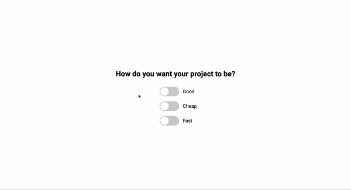

# 50 Projects in 50 Days - Good Cheap Fast

This is a code along project in the [50 Projects In 50 Days - HTML, CSS & JavaScript Udemy Course](https://www.udemy.com/course/50-projects-50-days/). Sharpen your skills by building 50 quick, unique & fun mini projects.

## Table of contents 😌

- [Overview](#overview)
  - [The project](#the-project)
  - [Screenshot](#screenshot)
  - [Links](#links)
- [My process](#my-process)
  - [Built with](#built-with)
  - [What I learned](#what-i-learned)
  - [Continued development](#continued-development)
  - [Code snippets](#im-really-proud-of-these-code-snippets%EF%B8%8F)
  - [Useful resources](#useful-resources)
- [Author](#author)
- [Acknowledgments](#acknowledgments)

## Overview👋🏾

Welcome to the 32<sup>nd</sup> mini-project of the course!

### The project😥

In this project users will be able to:

- Build a responsive site that displays animated checkboxes.

### Screenshot🌇



### Links👩🏾‍💻

- Live Site URL: (https://scintillating-dragon-bf4f4e.netlify.app/)

## My process💭

This is a simple project that I started by marking out initial structure, classes, and id's in HTML. Next I finalized the UI by styling the CSS. I styled the three checkboxes to look like slider widgets with balls that I animated to move back and forth. I then added functionality by way of JavaScript to switch between the 2 ways a project can be created: either Good and Cheap, or Cheap and Fast.

### Built with👷🏾‍♀️

- Semantic HTML5 markup
- CSS custom properties
- Flexbox
- JavaScript

### What I learned👩🏾‍🏫

When you have a checkbox and you want to add an event to it you have to use change not click.


### Continued development🔮

In the future I plan on continuing to practice animations to make my pages more dynamic.

I also plan on continuing to practice using event listeners to make my pages more functional.

I also plan on continuing to learn the best ways to phrase git commits, so that future viewers can fully understand the changes that have occurred.

### I'm really proud of these code snippets✂️

```css
.ball {
  background-color: #fff;
  height: 34px;
  width: 34px;
  border-radius: 50%;
  position: absolute;
  top: 3px;
  left: 3px;
  align-items: center;
  justify-content: center;
  animation: slideOff 0.3s linear forwards;
}

.toggle:checked + .label .ball {
  animation: slideOn 0.3s linear forwards;
}

@keyframes slideOn {
  /* default values */
  0% {
    transform: translateX(0) scale(1);
  }
  50% {
    transform: translateX(20px) scale(1.2);
  }
  100% {
    transform: translateX(40px) scale(1);
  }
}

@keyframes slideOff {
  0% {
    transform: translateX(40px) scale(1);
  }
  50% {
    transform: translateX(20px) scale(1.2);
  }
  100% {
    transform: translateX(0) scale(1);
  }
}
```

```js
toggles.forEach(toggle => toggle.addEventListener('change', (e) => doTheTrick(e.target)))

doTheTrick = (theClickedOne) => {
    if (good.checked && cheap.checked && fast.checked) {
        if (good === theClickedOne) {
            fast.checked = false
        }
        if (cheap === theClickedOne) {
            good.checked = false
        }
        if (fast === theClickedOne) {
            cheap.checked = false
        }
    }
}
```

### Useful resources📖

- [Resource](https://www.freecodecamp.org/news/how-to-write-better-git-commit-messages/) - This is an amazing article which helped me write better commit messages. I'd recommend it to anyone still learning this concept.

## Author🔎

- Website - [Portfolio Site](https://maiannethornton.netlify.app/)
- Frontend Mentor - [@MaianneThornton](https://www.frontendmentor.io/profile/MaianneThornton)
- GitHub - [@MaianneThornton](GitHub.com/MaianneThornton)
- Twitter - [@MaianneThornton](https://twitter.com/MaianneThornton)
- LinkedIn - [@MaianneThornton](https://www.linkedin.com/in/maiannethornton/)

## Acknowledgments🙏🏾

Special Thanks go to [Brad Traversy](http://www.traversymedia.com/) and [Florin Pop](http://www.florin-pop.com/) creating the course and making reviewing concepts fun 😊.
